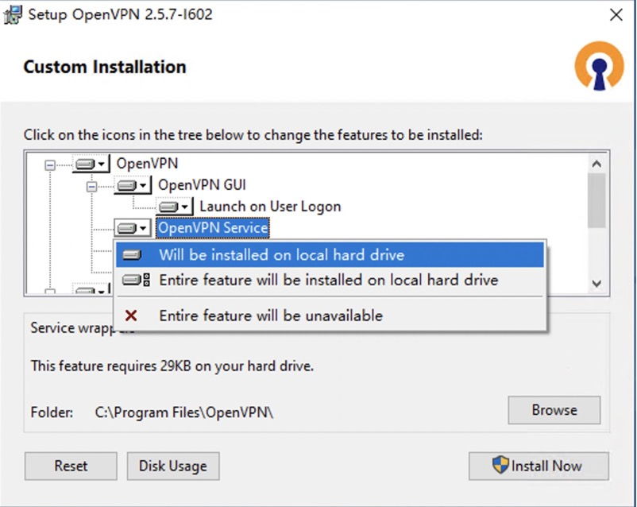
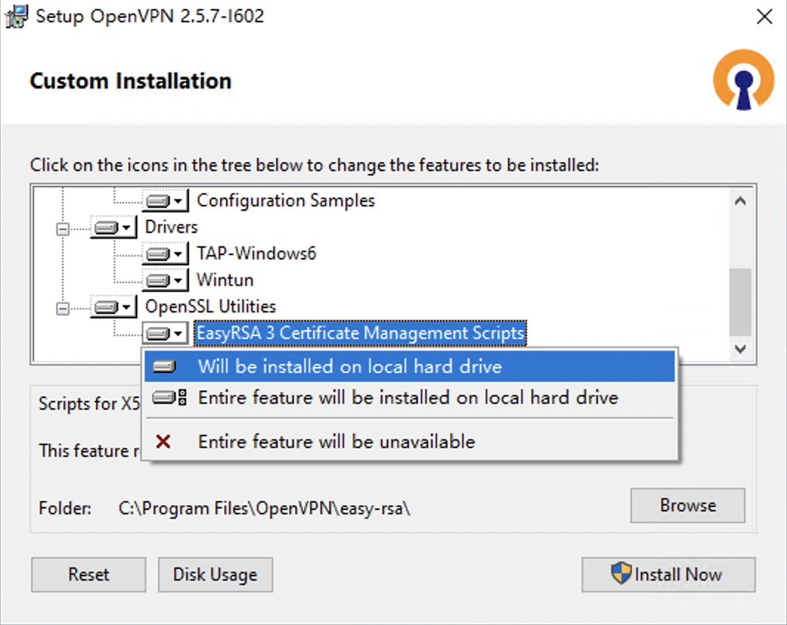

# 搭建openVpn服务器

## 1. OpenVpn介绍

### 1.1 OpenVpn原理
> &emsp;&emsp;OpenVPN的技术核心是虚拟网卡，其次是SSL协议实现。
> &emsp;&emsp;虚拟网卡是使用网络底层编程技术实现的一个驱动软件。安装此类程序后主机上会增加一个非真实的网卡，并可以像其它网卡一样进行配置。服务程序可以在应用层打开虚拟网卡，如果应用软件（如网络浏览器）向虚拟网卡发送数据，则服务程序可以读取到该数据。如果服务程序写合适的数据到虚拟网卡，应用软件也可以接收得到。虚拟网卡在很多的操作系统中都有相应的实现，这也是OpenVPN能够跨平台使用的一个重要原因。
&emsp;&emsp;在OpenVPN中，如果用户访问一个远程的虚拟地址（属于虚拟网卡配用的地址系列，区别于真实地址），则操作系统会通过路由机制将数据包（TUN模式）或数据帧（TAP模式）发送到虚拟网卡上，服务程序接收该数据并进行相应的处理后，会通过SOCKET从外网上发送出去。这完成了一个单向传输的过程，反之亦然。当远程服务程序通过SOCKET从外网上接收到数据，并进行相应的处理后，又会发送回给虚拟网卡，则该应用软件就可以接收到。

### 1.2 加密和身份验证
&emsp;&emsp;OpenVPN支持基于加密证书的双向认证。在OpenVPN中，不管是服务器还是客户端，所有的证书和私钥都需要由服务器端生成，客户端要先获得服务器端分配给它的加密证书和密钥才能成功连接。客户端只需要安装好软件，然后复制服务端生成的配置到客户端即可。

>(1) 加密
&emsp;&emsp;OpenVPN使用OpenSSL库来加密数据与控制信息。这意味着，它能够使用任何OpenSSL支持的算法。它提供了可选的数据包HMAC功能以提高连接的安全性。此外，OpenSSL的硬件加速也能提高它的性能。2.3.0以后版本引入PolarSSL。

>(2) 身份验证
&emsp;&emsp;OpenVPN提供了多种身份验证方式，用以确认连接双方的身份，包括：
① 预享私钥
② 第三方证书
③ 用户名／密码组合

>&emsp;&emsp;预享密钥最为简单，但同时它只能用于创建点对点的VPN；基于PKI的第三方证书提供了最完善的功能，但是需要额外维护一个PKI证书系统。OpenVPN2.0后引入了用户名／口令组合的身份验证方式，它可以省略客户端证书，但是仍需要一份服务器证书用作加密。

## 2. 使用的环境

### 2.1 服务器操作系统
    使用的是操作系统是window10, CPU是 Intel J4125

### 2.2 openVpn版本
    openVpn版本：2.5.7


## 3. 安装openVpn服务端

### 3.1 openVpn服务端安装
1. 服务端选自定义，客户端直接选安装即可：


2. 安装服务端，一定要记得选下图中选项：


3. 勾选下图选项，方便CA等文件的制作：


   最后在默认安装路径C:\Program Files\OpenVpn找到服务端即可。

## 4. CA 服务端证书和密钥 客户端证书和密钥制作

&emsp;&emsp;复制目录C:\Program Files\OpenVPN\easy-rsa下vars.example并重命名为vars，然后找到并修改部分参数为如下:
```shell
set_var EASYRSA_REQ_COUNTRY	    "CN"    # 国家
set_var EASYRSA_REQ_PROVINCE	    "GD"    # 省
set_var EASYRSA_REQ_CITY	    "SZ"    # 城市
set_var EASYRSA_REQ_ORG	            "DY"    # 组织
set_var EASYRSA_REQ_EMAIL	    "DY@flex.net"
set_var EASYRSA_REQ_OU	            "DY"    # 组织单元

set_var EASYRSA_KEY_SIZE	    2048    # 密钥长度
set_var EASYRSA_CA_EXPIRE	    3650    # 根CA有效时间，单位为天
set_var EASYRSA_CERT_EXPIRE	    825     # 生成的服务端和客户端证书有效期

```
&emsp;&emsp;Cmd管理员运行，然后进入C:\ProgramFiles\OpenVPN\easy-rsa目录下运行EasyRSA-Start.bat 进入EasyRSA Shell命令模式：

```shell
cd C:\Program Files\OpenVPN\easy-rsa   #进入RSA目录下
EasyRSA-Start.bat                      #运行EasyRSA-Start.bat进入 shell模式    

```

&emsp;&emsp;初始化目录


&emsp;&emsp;创建根证书


&emsp;&emsp;创建服务端证书及公钥


&emsp;&emsp;创建Diffie-Hellman，确保key穿越不安全网络的命令


&emsp;&emsp;创建客户端证书及公钥


## 5. 服务器端和客户端配置

### 5.1 服务端配置
>&emsp;&emsp;**`ca.crt`**、**`dh.pem`**、**`servervpn.crt`**、**`servervpn.key`** 是服务端运行的必要文件，所以要将这四个文件复制到 **`C:\Program Files\OpenVPN\config`** 这个目录中。

***
&emsp;&emsp;新建一个 **`server.ovpn`** 在 **`C:\Program Files\OpenVPN\config`** 内容如下：
```conf
# server.ovpn文件内容参数解释
# ";"   、"#" 注释符，代表后面的语句不生效

local 0.0.0.0                             #监听地址
port 10231                                #监听端口，自定义
proto tcp                                 #协议，可tcp或者udp
dev tap                                   #tap模式, TAP是二层的，TUN是三层的。
                                          ;dev tun
ca ca.crt                                 #ca位置，如果和server.ovpn同目录，直接写文件名即可，如果不是同目录，那么写绝对路径也可以
cert server.crt                           #服务端证书，如果同目录，直接写文件名即可，如果不是，可以写绝对路径
key server.key                            #同上
dh dh.pem                                 #同上，交换密钥文件
server 10.10.10.0 255.255.255.0           #用于vpn的网段，即服务器自动生成的tap网卡ip和客户端拨号后分配的ip
ifconfig-pool-persist ipp.txt             #定义客户端和虚拟ip地址之间的关系。特别是在openvpn重启时,再次连接的客户端将依然被分配和断开之前的IP地址
push "route 172.21.0.0 255.255.255.0"     #推送路由，假如客户端的IP地址为10.8.0.2，要访问192.168.10.0网段的话，使用这条命令就可以了。如果有网段的话，可以多次出现push route关键字
;push "redirect-gateway def1 bypass-dhcp" #如果想要默认都走vpn，使用此配置
push "dhcp-option DNS 114.114.114.114" 	  #推送dns地址
                                          ;push "dhcp-option DNS 223.5.5.5"
client-to-client                          #允许客户端和客户端连接，默认情况下客户端只能与服务器相连接
duplicate-cn                              # 定义openvpn一个证书在同一时刻是否允许多个客户端接入，默认没有启用
;tls-auth ta.key 0                        #TLS认证密钥 防止DDOS等，UDP淹没等恶意攻击，服务器端配置为0 客户端配置为1
keepalive 10 120                          #每10s ping一次，连接超时时间设置为120s
cipher AES-256-CBC                        #加密算法
comp-lzo                                  #开启vpn连接压缩，如果服务器端开启，客户端也必须开启
;user nobody                              #linux下运行后降低用户权限，为了安全
;group nobody    
persist-key                               #通过keepalive检测超时后，重新启动VPN，不重新读取keys，保留第一次使用的keys
persist-tun                               #持久化选项可以尽量避免访问在重启时由于用户权限降低而无法访问的某些资源
auth-nocache                              #不允许缓存认证信息，密码等，配置后连接不会报密码缓存在内存等告警消息
status openvpn-status.log                 #把openvpn的一些状态信息写到文件中，比如客户端获得的IP地址。
verb 3                                    #日志级别3，可选0---9，等级越高日志内容越详细
;explicit-exit-notify 1
```

### 5.2 客户端配置
&emsp;&emsp;在客户端电脑config目录下创建clientvpn.ovpn(文件名随意)，内容如下：
```conf
client
dev tap                                                   ;dev tun
proto tcp
remote 111.101.123.234 10231                              #服务器端IP 端口
resolv-retry infinite
nobind                                                    #不绑定本机发起端口，配置了即使用随机端口作为源端口
                                                          ;user nobody
                                                          ;group nobody
                                                          ;route 172.21.0.0 255.255.255.0  #注释掉，不生效，因为服务端配置了push后会自动下发路由
persist-key
persist-tun
cipher AES-256-CBC
                                                          ;http-proxy-retry # retry on connection failures
                                                          ;http-proxy [proxy server] [proxy port #]
mute-replay-warnings
ca ca.crt                                                 #配置ca，如果文件和配置文件在同一个目录，则直接写文件名，不在同目录，则对应改掉。
cert clientvpn.crt                                        #客户端证书  如上解释
key clientvpn.key                                         #如上解释
auth-nocache                                              #不缓存用户名密码
                                                          ;ns-cert-type server
;tls-auth ta.key 1                                        #TLS认证密钥 防止DDOS 攻击，UDP淹没等恶意攻击，服务器端配置为0 客户端配置为1
remote-cert-tls server
comp-lzo
verb 3
```

## 6. IP路由
>&emsp;&emsp;Windows的IP转发功能默认关闭，如果将其开启，则这个PC具备路由转发功能


>&emsp;&emsp;修改注册表，开启IP转发,修改注册表`HKEY_LOCAL_MACHINE\SYSTEM\CurrentControlSet\Services\Tcpip\Parameters` 下 `IPEnableRouter`的默认值，改为1即可


>后续的安全配置有需要的小伙伴可以自己研究研究。


